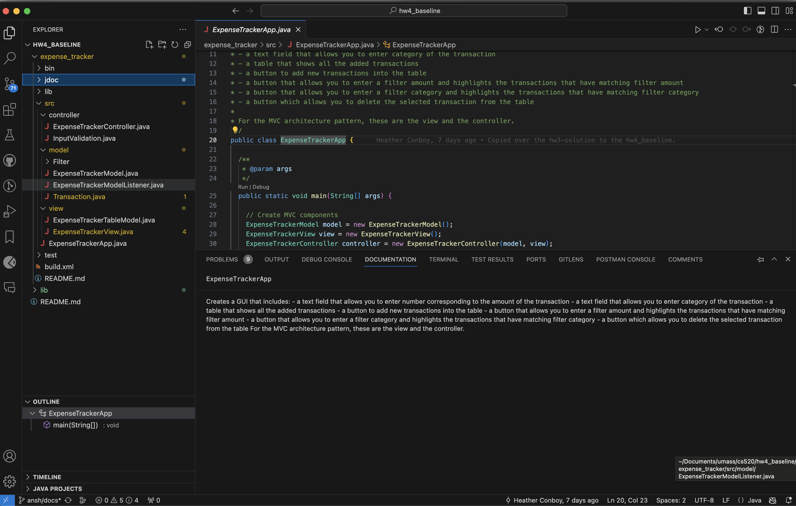
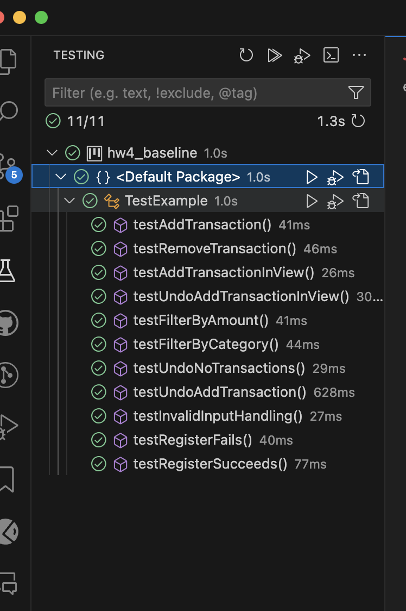
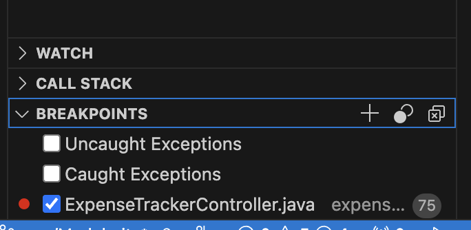
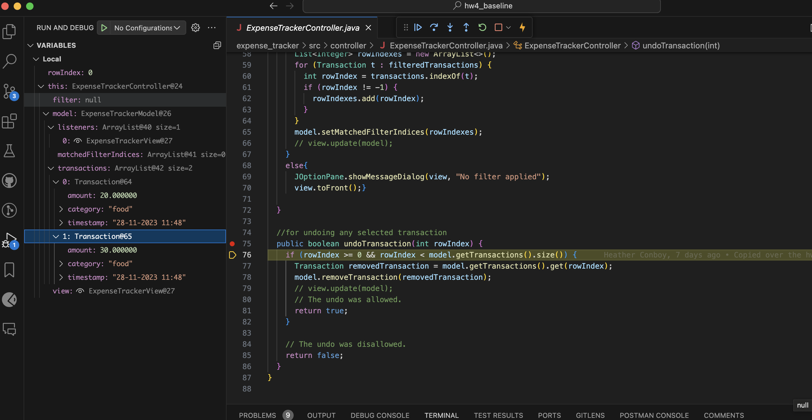
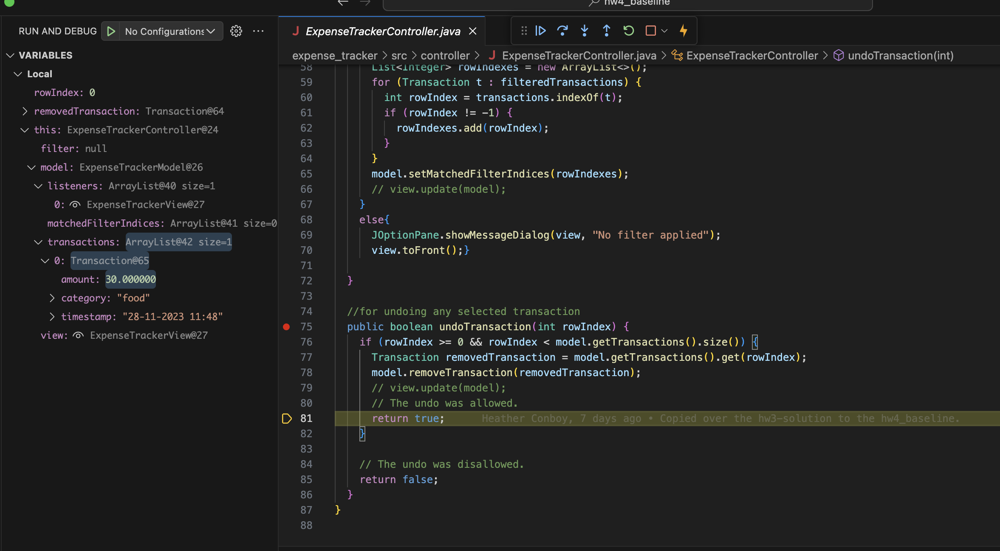

member name: Anshumaan Chauhan, Hsin-Yu Wen

1. Java API view (e.g., javadoc, class outline)

2. JUnit test runner showing all of your test cases passing

3. Debugger showing the breakpoint for the undo

4. Debugger showing the program execution state(usually the variables view) after calling add transaction but before calling undo (show the model and/or UI widgets set appropriately)

5. Debugger showing the program execution state (usually the variables view) after calling the undo (show the model and/or UI widgets are empty again)

